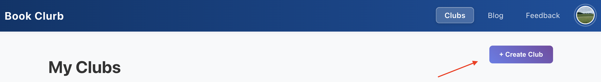
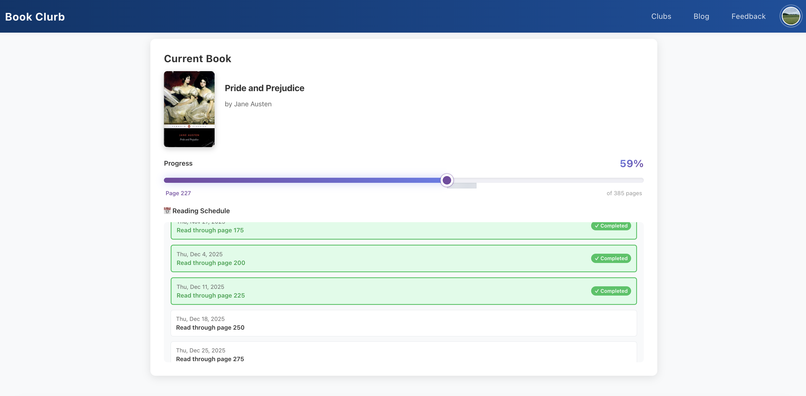
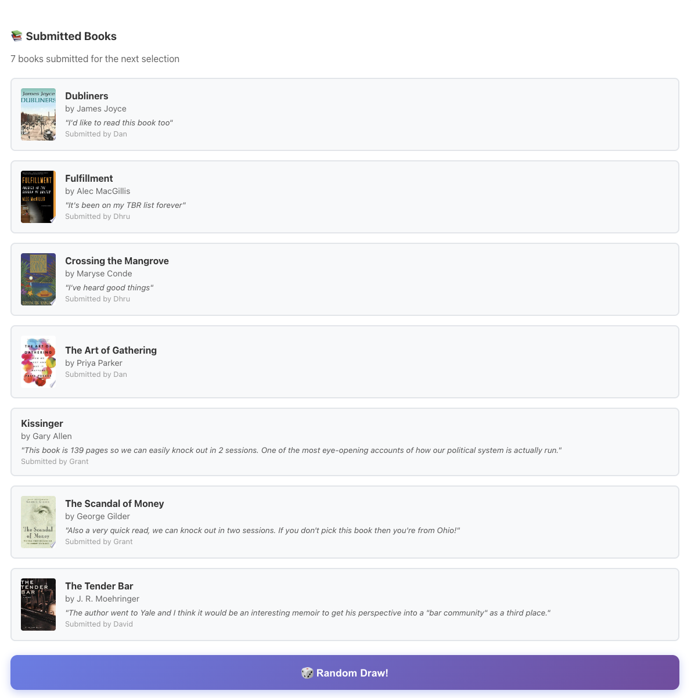
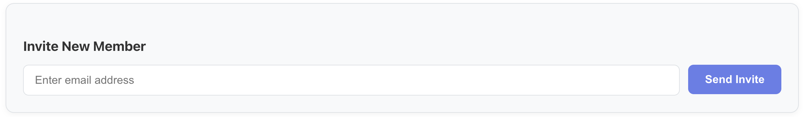
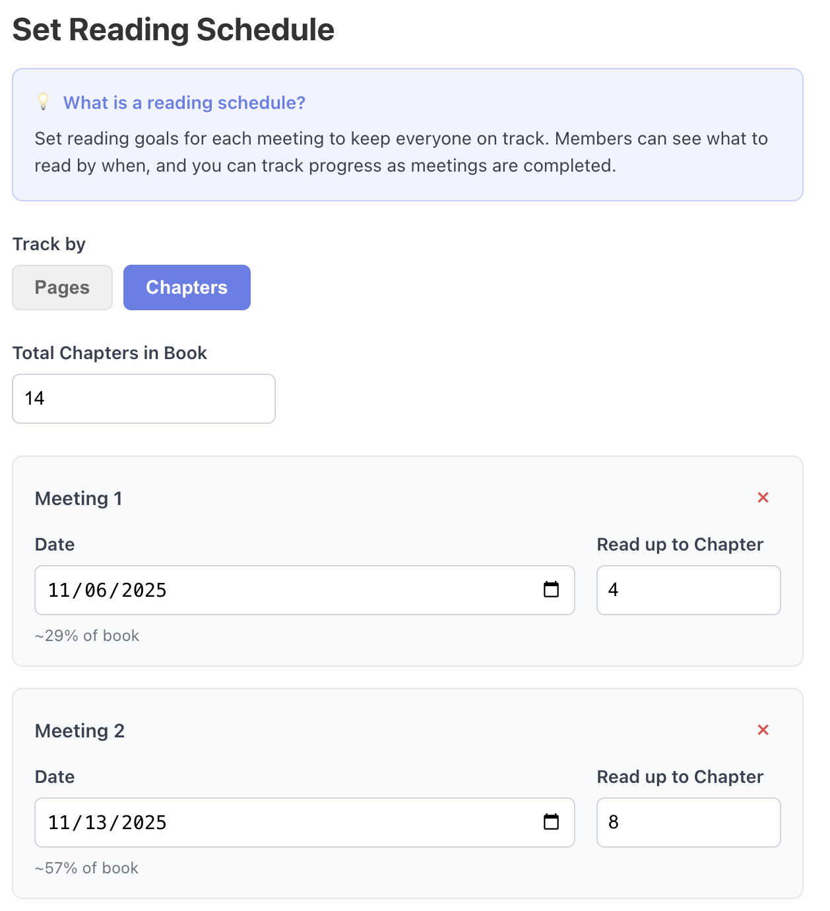
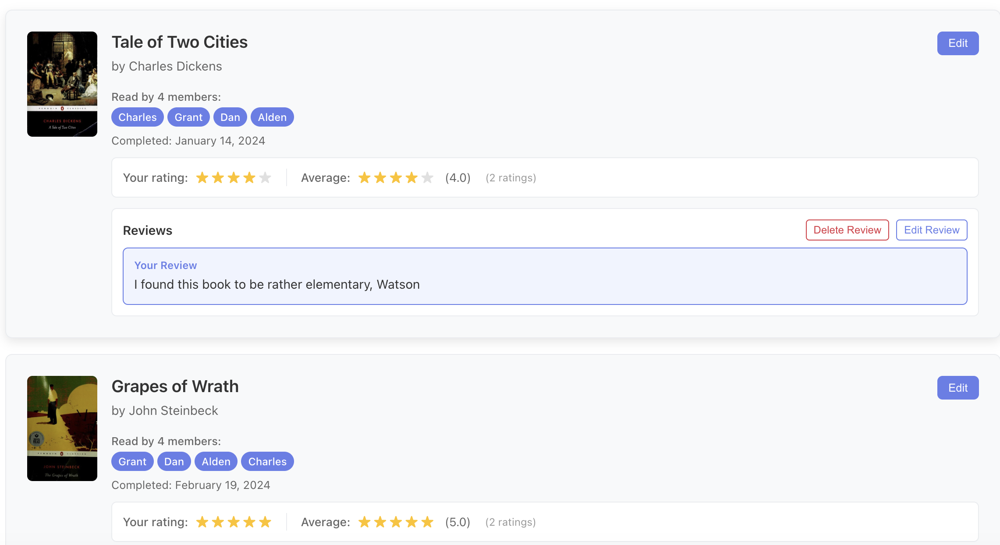

# BookClurb v1 Features & Feedback

## What's Included in v1

v1 is geared toward the *book club admin*. There are challenges with being the admin. It requires managing the meeting schedule, selecting the next book in a way that is fair, communicating readings to members, and all of the other give and take that comes with leading a group.

## We Want Your Feedback!

Right now, the most important thing for us is to get feedback from book club admins on what they think about the site, and if they have any ideas for how to improve it. We've created a structured feedback form, and we would be very grateful to get input from book club admins. It helps to inform the path that we are going.

The feedback form can be found [here](https://docs.google.com/forms/d/e/1FAIpQLSfXl_-UCDy8lxtexUUN7IB7eJzTiRLX6cN3f88oqk73YmI8Lw/viewform).

## Features

### Club Management

Create and manage multiple book clubs with customizable settings and member roles.

### Meeting Organization & Reflections

Schedule meetings with reading assignments and collect reflections from members.

### Book Selection & Voting

Submit book suggestions and vote using random selection or ranked choice voting with live results.

### Member Invitations

Send email invitations and manage member roles and participation.

### Reading Tracking

Set reading schedules and track progress with visual progress bars.

### Book Ratings & History

Rate books after completion and maintain a reading history for each club.

## How to Get Started

1. **Sign up** - Create an account using email/password or Google Sign-In
2. **Create a club** - Click "Create Club" and set up your book club
3. **Invite members** - Send email invitations to friends
4. **Add books** - Submit book suggestions for your club to vote on
5. **Schedule meetings** - Set up your first meeting with reading assignments
6. **Track progress** - Update your reading progress and submit reflections

## What's Next?

We want to understand the pain points of managing a book club first, anything that makes the book club admin's job easier. It could be reading in data from a spreadsheet, exporting data, figuring out the right onboarding flow.

In the future, we want to make it easier for book clubs to connect with the authors that they are reading. There are many talented authors out there that are looking for the readers. From the book club's perspective, we believe that, especially in this day and age, people want to read things that are real, from people who are real. There's so much machine generated garbage out there. Reading something that is clearly written by another human is refreshing. Connecting with other people is refreshing. This project intends to enable this kind of connection.

Your feedback helps us prioritize what to build next. Thank you for being part of the BookClurb community!
---

**Questions or need help?** Check out our [GitHub repository](https://github.com/dhvogel/bookclurb) or open an issue. We're here to help!

